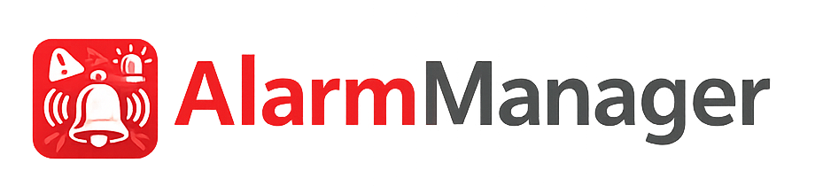

# ioBroker.alarmmanager

**Tests:** 

## Ich habe einen ersten Teststand meines Adapters AlarmManager auf GitHub veröffentlicht
Repository: https://github.com/t0Puk/ioBroker.alarmmanager

Testinstallation:
iobroker url https://github.com/t0Puk/ioBroker.alarmmanager/tarball/main --host this

Getestet werden sollen aktuell:
- Verbindung zu e*Message
- Testversand
- Trigger über State
- Rückmeldelogik
- Admin-Oberfläche

Feedback mit Log und Screenshots ist willkommen.

## alarmmanager adapter for ioBroker

Pager alarm system via e*Message API with escalation, acknowledgements and state-based triggers

## Developer manual
This section is intended for the developer. It can be deleted later.

### DISCLAIMER

Please make sure that you consider copyrights and trademarks when you use names or logos of a company and add a disclaimer to your README.
You can check other adapters for examples or ask in the developer community. Using a name or logo of a company without permission may cause legal problems for you.

## Changelog
<!--
	Placeholder for the next version (at the beginning of the line):
	### **WORK IN PROGRESS**
-->

### **WORK IN PROGRESS**
* (TobiasP) initial release

## License
MIT License

Copyright (c) 2026 TobiasP 

Permission is hereby granted, free of charge, to any person obtaining a copy
of this software and associated documentation files (the "Software"), to deal
in the Software without restriction, including without limitation the rights
to use, copy, modify, merge, publish, distribute, sublicense, and/or sell
copies of the Software, and to permit persons to whom the Software is
furnished to do so, subject to the following conditions:

The above copyright notice and this permission notice shall be included in all
copies or substantial portions of the Software.

THE SOFTWARE IS PROVIDED "AS IS", WITHOUT WARRANTY OF ANY KIND, EXPRESS OR
IMPLIED, INCLUDING BUT NOT LIMITED TO THE WARRANTIES OF MERCHANTABILITY,
FITNESS FOR A PARTICULAR PURPOSE AND NONINFRINGEMENT. IN NO EVENT SHALL THE
AUTHORS OR COPYRIGHT HOLDERS BE LIABLE FOR ANY CLAIM, DAMAGES OR OTHER
LIABILITY, WHETHER IN AN ACTION OF CONTRACT, TORT OR OTHERWISE, ARISING FROM,
OUT OF OR IN CONNECTION WITH THE SOFTWARE OR THE USE OR OTHER DEALINGS IN THE
SOFTWARE.
